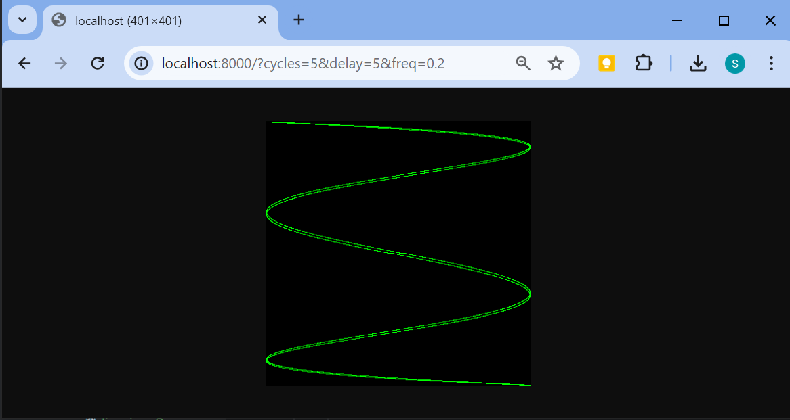
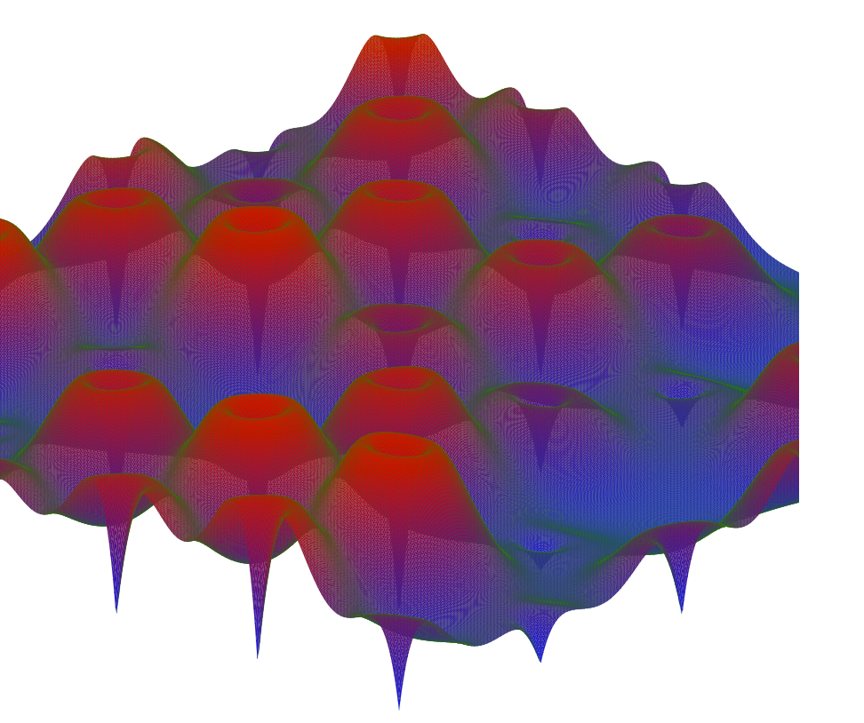
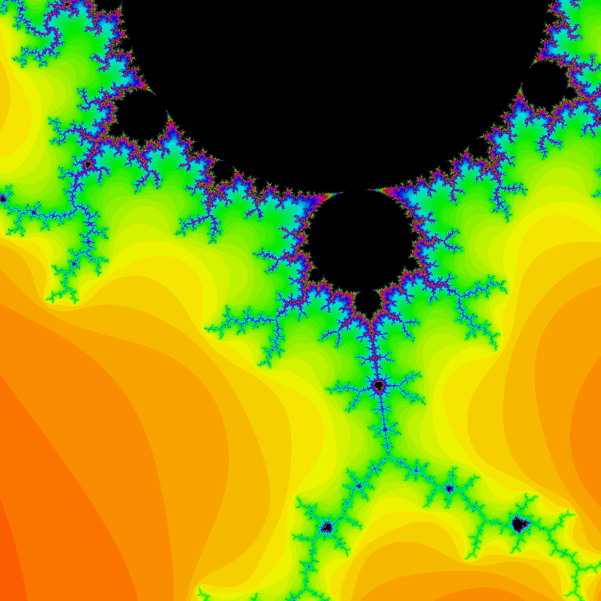
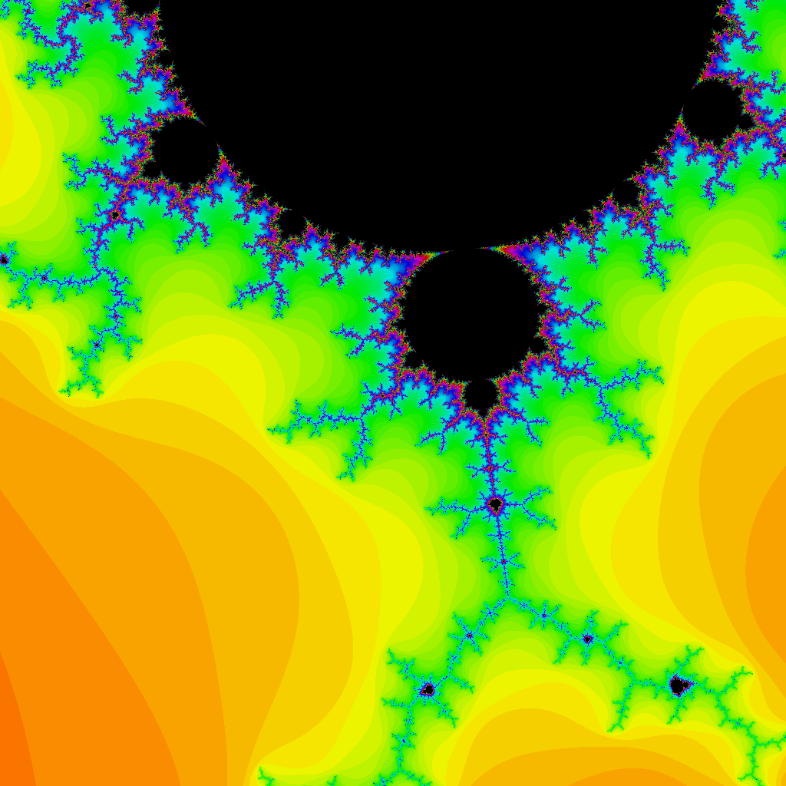

## Глава1
### Упражнение 1.1:
Измените программу `echo` так, чтобы она выводила также `os.Args[0]`, имя выполняемой команды.

### Упражнение 1.2:
Измените программу `echo` так, чтобы она выводила индекс и значение каждого аргумента по одному аргументу в строке.

### Упражнение 1.3:
Поэкспериментируйте с измерением разницы времени выполнения потенциально неэффективных версий и версии с применением `strings.Join`. (В разделе 1.6 демонстрируется часть пакета `time`, а в разделе 11.4 — как написать тест производительности для ее систематической оценки.)

### Упражнение 1.4:
Измените программу `dup2` так, чтобы она выводила имена всех файлов, в которых найдены повторяющиеся строки.

#### Инструкции по запуску для Упражнения 1.4:

```bash
# Соберите исполняемый файл
go build -o exercise4.exe exercise4.go

# Запустите исполняемый файл без аргументов, чтобы увидеть стандартное поведение программы
.\exercise4.exe

# Запустите исполняемый файл с указанием конкретного входного файла (например, input_for_test.txt)
.\exercise4.exe input_for_test.txt

```

### Упражнение 1.5. 
Измените палитру программы lissajous так, чтобы изображение было зеленого цвета на черном фоне, чтобы быть более похожим на экран осциллографа. Чтобы создать веб-цвет #RRGGBB, воспользуйтесь инструкцией color.RGBA{0xRRj0xGG,0xBB,0xff}, в которой каждая пара шестнадцатеричных цифр представляет яркость красного, зеленого и синего компонентов пикселя.
### Упражнение 1.6. 
Измените программу lissajous так, чтобы она генерировала изображения разных цветов, добавляя в палитру palette больше значений, а затем выводя их путем изменения третьего аргумента функции SetColorIndex некоторым нетривиальным способом
### Упражнение 1.7
Вызов функции io.Copy(dst, src) выполняет чтение из src и запись в dst. Воспользуйтесь ею вместо ioutil.ReadAll для копирования тела ответа в поток os.Stdout без необходимости выделения достаточно большого буфера для хранения всего ответа. Не забудьте проверить, не произошла ли ошибка при вызове io.Copy.

Инструкция по запуску по запуску для Упражнения 1.7:

```bash
# Соберите исполняемый файл
go build -o fetch.exe fetch.go
# Запустите исполняемый файл с указанием конкретного входного url
.\fetch.exe http://google.com
```


### Упражнение 1.8.
Измените программу `fetch` так, чтобы к каждому аргументу URL автоматически добавлялся префикс `http://` в случае отсутствия в нем такового. Можете воспользоваться функцией `strings.HasPrefix`.
```bash
# запустите исполняемый файл, передавая url в качестве аргумента без указания протокола
go run fetch.go google.com google.com
```

### Упражнение 1.9.
Измените программу `fetch` так, чтобы она выводила код состояния HTTP, содержащийся в `resp.Status`.

```bash
go build -o fetch.exe .\fetch.go
.\fetch.exe  example.com 
```

### Упражнение 1.10. 
Найдите веб-сайт, который содержит большое количество данных. Исследуйте работу кеширования путем двукратного запуска fetchall и сравнения времени запросов. Получаете ли вы каждый раз одно и то же содержимое? Измените fetchall так, чтобы вывод осуществлялся в файл и чтобы затем можно было его изучить.
### Упражнение 1.11. 
Выполните fetchall с длинным списком аргументов, таким как образцы, доступные на сайте alexa.com. Как ведет себя программа, когда веб-сайт просто не отвечает? (В разделе 8.9 описан механизм отслеживания таких ситуаций.)

### Упражнение 1.12. 
Измените сервер с фигурами Лиссажу так, чтобы значения параметров считывались из URL. Например, URL вида `http://localhost:8000/?cycles=20` устанавливает количество циклов равным 20 вместо значения по умолчанию, равного 5. Используйте функцию `strconv.Atoi` для преобразования строкового параметра в целое число. Просмотреть документацию по данной функции можно с помощью команды `go doc strconv.Atoi`.
`http://localhost:8000/?cycles=5&delay=5&freq=0.2`


### Упражнение 2.1. 
Добавьте в пакет tempconv типы, константы и функции для работы с температурой по шкале Кельвина, в которой нуль градусов соответствует температуре-273.15°С, а разница температур в 1К имеет ту же величину, что и 1°С.
### Упражнение 2.2. 
Напишите программу общего назначения для преобразования единиц, аналогичную c f, которая считывает числа из аргументов командной строки (или из стандартного ввода, если аргументы командной строки отсутствуют) и преобразует каждое число в другие единицы, как температуру — в градусы Цельсия и Фаренгейта, длину — в футы и метры, вес — в фунты и килограммы и т.д.
```bash
go build -o excercise2.go
.\excercise2.exe -from c -to f -temp 16
```

### Exercise 2.3: 
Rewrite PopCount to use a loop instead of a single expression.
Compare the performance of the two versions. (Section 11.4 shows how to compare the performance of
different implementations systematically.)

### Exercise 2.4: 
Write a version of PopCount that counts bits by shifting its argument through 64
bit position s, testing the rightmost bit each time. Compare its performance to the table lookup version.

### Exercise 2.5: 
The expression x&(x-1) clears the rightmost non-zero bit of x. Write a version
of PopCount that counts bits by using this fact, and assess its performance

## Exercise 3.1
If the function `f` returns a non-finite `float64` value, the SVG file will contain invalid `<polygon>` elements (although many SVG renderers handle this gracefully). Modify the program to skip invalid polygons.

## Exercise 3.2
Experiment with visualizations of other functions from the math package. Can you produce an egg box, moguls, or a saddle?

## Exercise 3.3
Color each polygon based on its height, so that the peaks are colored red (`#ff0000`) and the valleys blue (`#0000ff`).

## Exercise 3.4
Following the approach of the Lissajous example in Section 1.7, construct a web server that computes surfaces and writes SVG data to the client. The server must set the `Content-Type` header like this:

`http://localhost:8001/?cells=700`


## Exercise 3.5
Implement a full-color Mandelbrot set using the function `image.NewRGBA` and the type `color.RGBA` or `color.YCbCr`.


## Exercise 3.6
Supersampling is a technique to reduce the effect of pixelation by computing the color value at several points within each pixel and taking the average. The simplest method is to divide each pixel into four “subpixels.” Implement it.
```
go run .\resampling.go server
```


## Exercise 3.7
Another simple fractal uses Newton’s method to find complex solutions to a function such as $ z^4 - 1 = 0 $. Shade each starting point by the number of iterations required to get close to one of the four roots. Color each point by the root it approaches.
```
go run .\newtonFractal.go server
```

## Exercise 3.8
Rendering fractals at high zoom levels demands great arithmetic precision. 
Implement the same fractal using four different representations 
of numbers: `complex64`, `complex128`, `big.Float`, and `big.Rat`. 
(The latter two types are found in the `math/big` package. 
`Float` uses arbitrary but bounded-precision floating-point; 
`Rat` uses unbounded-precision rational numbers.) 
How do they compare in performance and memory usage? 
At what zoom levels do rendering artifacts become visible?

## Usage

You can run the program in two modes:

1. **Image generation and saving to files.**
2. **Running a web server for dynamic image generation.**

### Image Generation

By default, the program will generate four images of different Mandelbrot fractal versions and save them in the current directory.

```bash
go run fractal.go
```
## Running the Web Server

To run the web server, use the following command:

```bash
go run fractal.go server
```
The server will be started on port 8000. You can specify fractal parameters via the URL.

Example Request
```
http://localhost:8000/?scale=11.05&fn=128&centerX=-.140009&centerY=0.887
```
Parameters:
centerX (float64) — the center along the X-axis.
centerY (float64) — the center along the Y-axis.
scale (float64) — the scale of the image.
fn (string) — the method of forming the fractal:
64 — using complex numbers with floating-point (float32).
128 — using complex numbers with floating-point (float64).
bf — using big numbers big.Float.
br — using rational numbers big.Rat.


## Mandelbrot 64-bit


## Mandelbrot 128-bit


## Mandelbrot BigFloat


## Exercise 3.9
Write a web server that renders fractals and writes the image data to the client. Allow the client to specify the `x`, `y`, and `zoom` values as parameters to the HTTP request.

## Exercise 3.10
Write a non-recursive version of `comma`, using `bytes.Buffer` instead of string concatenation.

## Exercise 3.11
Enhance `comma` so that it deals correctly with floating-point numbers and an optional sign.

## Exercise 3.12
Write a function that reports whether two strings are anagrams of each other, that is, they contain the same letters in a different order.
